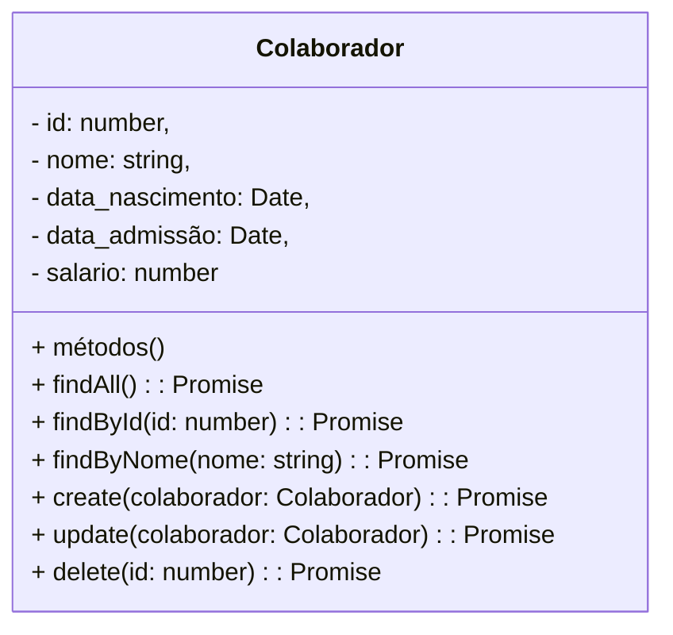
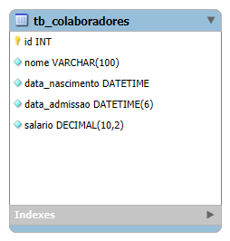

# GroupTwo RH - Backend

 

    

  

## 1. Descrição

Este projeto consiste no desenvolvimento de uma aplicação para a gestão de colaboradores de um departamento de RH, utilizando tecnologias modernas e robustas. Ele permite o cadastro, consulta, atualização e exclusão de informações sobre os colaboradores, facilitando a organização e acessibilidade dos dados.

------

## 2. Sobre esta API

A API de Gerenciamento de Colaboradores permite que os sistemas de RH cadastrem, consultem, atualizem e excluam colaboradores.

### 2.1. Principais Funcionalidades

1. Cadastro de Colaboradores: Inserção de dados essenciais sobre o colaborador através do método HTTP: POST.
2. Consulta: Visualização dos colaboradores cadastrados por meio de endpoints específicos com HTTP: GET para consultas por id, nome ou a visualização geral de todos os contratados.
3. Atualização: Modificação de registros existentes no cadatro do colaborador por meio do HTTP: PUT.
4. Exclusão: Remoção de colaboradores do banco de dados através do ID pelo método HTTP: DELETE.

------

## 3. Diagrama de Classes

------

## 4. Diagrama Entidade-Relacionamento (DER)

    

------

## 5. Tecnologias utilizadas

| Item                          | Descrição  |
| ----------------------------- | ---------- |
| **Servidor**                  | Node JS    |
| **Linguagem de programação**  | TypeScript |
| **Framework**                 | Nest JS    |
| **ORM**                       | TypeORM    |
| **Banco de dados Relacional** | MySQL      |

------

## 6. Configuração e Execução

1. Clone o repositório
2. Instale as dependências: `npm install`
3. Configure o banco de dados no arquivo `app.module.ts`
4. Execute a aplicação: `npm run start:dev`
